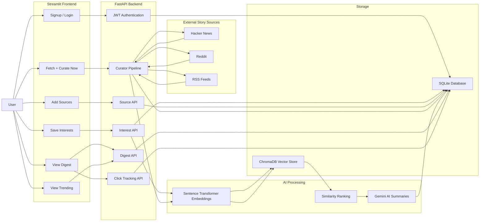

# 📰Personal Newsletter Curator

Personal Newsletter Curator is an AI-powered web app that creates a personalised reading digest based on the user's interests.

The user can sign up, save interests, add news sources, fetch stories, generate AI summaries, view a daily digest, track clicked stories, and see trending stories.

---

# 📌Project Objective

The goal of this project is to build a simple but practical AI newsletter app.

Instead of showing random news, the app allows the user to enter their own interests such as:

* Python
* Artificial Intelligence
* Software Development
* Startups
* Clean Energy
* Technology News

The backend fetches stories from saved sources, ranks them according to user interests, creates AI summaries, and saves a personalised digest.

---

# 🔄 System Workflow Diagram

The diagram below shows the complete workflow of the Personal Newsletter Curator project.




# ✨Features

### 1. User Authentication

* User signup
* User login
* JWT token-based authentication
* Protected backend endpoints
* Logout from frontend sidebar

### 2. Interest Management

* User can save free-text interests
* User can save topic tags
* Interest data is stored in the database
* Interest embeddings are created for personalised ranking

### 3. Source Management

* User can add story sources
* Supports Hacker News sources
* Supports Reddit sources if Reddit API credentials are added
* Duplicate sources are handled

### 4. Story Fetching

* Fetches stories from saved sources
* Skips duplicate stories
* Saves new stories in the database

### 5. AI Summarisation

For each selected story, the AI generates:

* A short summary
* A “why this matters to you” explanation

### 6. Digest Creation

* Creates a personalised digest
* Ranks stories based on relevance to user interests
* Stores digest history

### 7. Click Tracking

* User can record clicks on stories
* Click history is saved
* Click count is shown on dashboard

### 8. Trending Stories

* Shows top stories from the latest digest
* Stories are sorted by engagement score
* Click history is visible in the Trending section

### 9. Dashboard

The dashboard shows:

* Number of saved digests
* Number of stories in the latest digest
* Number of saved sources
* Number of tracked clicks

### 10. Automatic Daily Curation with APScheduler

* APScheduler is integrated into the FastAPI backend.
* It automatically runs the curation pipeline daily at 7:00 AM.
* The scheduled job runs the curator pipeline for all registered users.
* It works alongside the manual **Fetch + Curate Now** option.


# 🛠 Tech Stack
### Backend

* Python
* FastAPI
* SQLite
* SQLAlchemy
* JWT authentication
* Pydantic
* Sentence Transformers
* ChromaDB
* Gemini API for summarisation
* APScheduler
* Requests

### Frontend

* Streamlit
* Python Requests
* Custom CSS styling

---

# 📂Project Folder Structure

```text
capstone-project/
│
├── Backend/
│   ├── main.py
│   ├── database.py
│   ├── models.py
│   ├── schema.py
│   ├── auth.py
│   ├── fetcher.py
│   ├── embedder.py
│   ├── ranker.py
│   ├── summariser.py
│   ├── digest_builder.py
│   ├── emailer.py
│   ├── scheduler.py
│   └── pipeline.py
│
├── Frontend/
│   └── app.py
│
├── requirements.txt
├── .env.example
├── README.md
└── .gitignore
```

# 🛢️🗄️Database Schema

The database schema is defined using SQLAlchemy ORM in:

```text
Backend/models.py
| Table        | Purpose                                                        |
| ------------ | -------------------------------------------------------------- |
| users        | Stores user account details and free-text interest description |
| interests    | Stores topic tags selected by each user                        |
| sources      | Stores RSS, Reddit, and Hacker News sources                    |
| stories      | Stores fetched stories from external sources                   |
| digests      | Stores generated digest records                                |
| digest_items | Stores stories included in each digest                         |
| clicks       | Stores user click history                                      |
```
## Storage
```
This project uses two types of storage:

| Storage  | Purpose                                                                      |
| -------- | ---------------------------------------------------------------------------- |
| SQLite   | Stores users, interests, sources, stories, digests, digest items, and clicks |
| ChromaDB | Stores vector embeddings for user interests and stories                      |

ChromaDB creates local vector storage during development. The generated ChromaDB folder is not uploaded to GitHub because it can be recreated when embeddings are generated.

```

## 🔐Environment Variables

Create a `.env` file in the main project folder.

```text
capstone-project/
│
├── Backend/
├── Frontend/
├── requirements.txt
├── .env
├── .env.example
├── README.md
└── .gitignore
```

Example `.env` file:

```env
GEMINI_API_KEY=your_gemini_api_key_here
JWT_SECRET=your_jwt_secret_here

GMAIL_EMAIL=your_email@gmail.com
GMAIL_APP_PASSWORD=your_gmail_app_password_here

REDDIT_CLIENT_ID=optional_reddit_client_id
REDDIT_CLIENT_SECRET=optional_reddit_client_secret
REDDIT_USER_AGENT=personal_newsletter_curator
```

# ⚠️⚠️ Important

Do not upload your real `.env` file to GitHub because it contains private API keys and passwords.

Instead, upload only `.env.example` with sample placeholder values.


# 🚀How to Run the Project

### 1. Open the project in VS Code

Open the main project folder:

```bash
cd capstone-project
```

---

### 2. Activate the virtual environment

For Windows PowerShell:

```bash
.venv\Scripts\activate
```

---

### 3. Install requirements

The `requirements.txt` file is in the main project folder.

```bash
pip install -r requirements.txt
```

---

### 4. Run the FastAPI backend

Go to the backend folder:

```bash
cd Backend
```

Run the backend server:

```bash
uvicorn main:app --reload
```

Backend runs at:

```text
http://127.0.0.1:8000
```

FastAPI Swagger docs are available at:

```text
http://127.0.0.1:8000/docs
```

Once the backend starts, APScheduler initialises automatically and schedules the daily curation job for 7:00 AM.

---

### 5. Run the Streamlit frontend

Open a second terminal.

From the main project folder, go to the frontend folder:

```bash
cd Frontend
```

Run the frontend:

```bash
streamlit run app.py
```

Frontend runs at:

```text
http://localhost:8501
```

# 📖How to Use the App

### Step 1: Signup or Login

Create a new account or login using an existing account.

---

### Step 2: Save Interests

Go to the **Interests** tab.

Example interest text:

```text
I am interested in Python, AI tools, software development, startups, clean energy, and technology news.
```

Example topic tags:

```text
Python, AI, Software Development, Startups, Clean Energy
```

Click **Save Interests**.

---

### Step 3: Add Sources

Go to the **Sources** tab.

Example Hacker News sources:

```text
source_type: hn
source_value: python
```

```text
source_type: hn
source_value: ai
```

```text
source_type: hn
source_value: startups
```

Reddit source example:

```text
source_type: reddit
source_value: Python
```

Note: Reddit requires Reddit API credentials in the `.env` file.

---

### Step 4: Run Curator

Go to the **Curate Now** tab.

Click:

```text
Fetch + Curate Now
```

The app will:

1. Fetch stories
2. Save new stories
3. Skip duplicate stories
4. Create story embeddings
5. Rank stories based on interests
6. Generate AI summaries
7. Create a digest

---

### Step 5: View Digest

Go to the **Digest** tab.

The app shows personalised story cards with:

* Title
* Source
* Relevance score
* Engagement score
* Comment count
* Summary
* Why this matters
* Record Click button
* Read full story button

---

### Step 6: Track Clicks

Click **Record Click** on any story.

This stores the clicked story in the backend.

---

### Step 7: View Trending

Go to the **Trending** tab.

This page shows:

* Top stories sorted by engagement score
* Click history

---

### Step 8: Logout

Use the logout button in the sidebar.

---

## Main API Endpoints

| Method | Endpoint             | Purpose                    |
| ------ | -------------------- | -------------------------- |
| GET    | `/`                  | Health/home endpoint       |
| POST   | `/signup`            | Create new user            |
| POST   | `/login`             | Login user                 |
| GET    | `/me`                | Get current logged-in user |
| PUT    | `/interests`         | Save user interests        |
| POST   | `/embed-interests`   | Create interest embedding  |
| POST   | `/sources`           | Add a source               |
| GET    | `/sources`           | Get saved sources          |
| POST   | `/run-curator`       | Run full curation pipeline |
| GET    | `/digests`           | Get saved digests          |
| POST   | `/clicks/{story_id}` | Record story click         |
| GET    | `/clicks`            | Get click history          |

---

# 🎬Demo Flow

For project demo, use this flow:

```text
Login
→ Dashboard
→ Save Interests
→ Add Sources
→ Fetch + Curate Now
→ View Digest
→ Record Click
→ View Trending
→ Logout
```

---

## Current Status

Working features:

* Signup and login
* JWT authentication
* Sidebar after login
* Interest saving
* Source saving
* Story fetching
* Duplicate story skipping
* AI summary generation
* Digest creation
* Digest display
* Click tracking
* Trending stories
* Dashboard metrics
* Logout

---

## Known Limitation

Reddit fetching requires Reddit API credentials.

If Reddit credentials are missing, Reddit sources will fail, but Hacker News sources will still work normally.

Example message:

```text
Reddit credentials are missing from the .env file
```

This does not break the full app because Hacker News sources can still fetch stories successfully.

---

## Future Improvements

Possible future improvements:

* Add email delivery for daily digest
* Add scheduler status page to show last automatic run time
* Add delete source option
* Add edit interests option
* Add better filtering by topic
* Add search inside digest history
* Improve mobile layout
* Add charts for click analytics

---

## Conclusion

Personal Newsletter Curator is a complete AI-based newsletter app that helps users read stories that match their interests.

It combines authentication, user preferences, story fetching, AI summarisation, ranking, digest creation, click tracking, and a Streamlit frontend into one working full-stack project.
